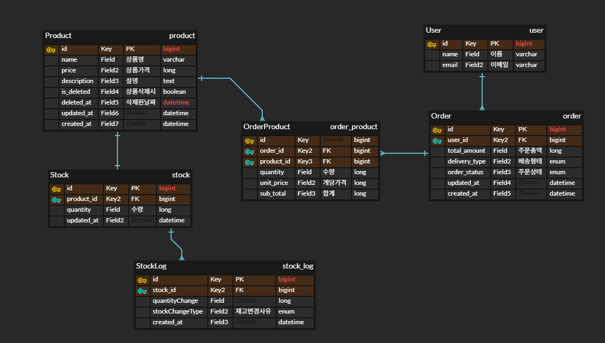

# 대용량 트래픽 개선 재고 관리 시스템 (Stock Flow)

## 1. 프로젝트 개요
- 할인 행사/이벤트 등 트래픽이 몰릴 경우, 응답 시간이 늦어지거나
동시성 문제로 재고 불일치가 발생할 수 있습니다. 

- 이 프로젝트에서는 대량 요청 상황을 가정하여,
DB 락 기반 처리와 Redis를 활용한 처리 방식을 비교하며
재고를 안정적으로 관리하기 위한 재고 관리 시스템을 구현하는 것을 목표로 합니다.

### 진행 순서
1. 기본 재고 관리 시스템 구현 (동기 처리)
2. Redis 선차감 + Publisher/Subscriber 비동기 처리
3. 응답 속도 및 처리량 비교 (JMeter)

### 주요 기능
- Redis를 재고 상태의 1차 저장소로 사용
- 주문 시 Redis에서 미리 재고 차감 (Lua 스크립트)
- 재고가 없을 시 주문 실패 반환
- 재고 차감 성공 후 DB는 Pub/Sub으로 비동기 반영
- 주기적으로 Redis & DB 동기화 (스케줄러)
- JMeter로 성능 테스트

### 서비스 흐름
- **온라인 주문**
    - 일반 배송: 물류 창고 재고 차감
    - 오늘드림/픽업: 해당 매장 재고 차감

- **오프라인 주문**
    - 매장 구매 시 온라인 매장 재고도 차감
    - 동기 처리, DB 반영 후 Redis 동기화

## 2. 기술 스택
- Java 21
- Gradle
- Spring Boot 3.5.7
- Spring Data JPA
- Redis
- MySQL
- Docker
- JMeter

## 3. 시스템 아키텍처
- 프로젝트 폴더 구조
```
stock-flow/
├─ stock-online/            : Spring Boot Application
│  ├─ src/
│  └─ build.gradle
├─ stock-domain/            : Entity 관리
│  ├─ src/
│  └─ build.gradle
├─ stock-common/            : 공통 라이브러리
│  ├─ src/
│  └─ build.gradle
├─ build.gradle
└─ settings.gradle
```

## 4. ERD 설계


## 5. API 명세
### 온라인
| 기능               | 메서드 | 엔드포인트                              |
|------------------|--------|------------------------------------|
| 상품 전체 조회         | GET | /api/products                      |
| 상품 상세 조회         | GET | /api/products/{productId}          |
| 주문 생성            | POST | /api/orders                        |
| 주문 취소            | PATCH | /api/orders/{orderId}/cancel       |
| 상품 전체 조회 (Redis) | GET | /api/redis/products                |
| 상품 상세 조회 (Redis) | GET | /api/redis/products/{productId}    |
| 주문 생성 (Redis)    | POST | /api/redis/orders                  |
| 주문 취소 (Redis)    | PATCH | /api/redis/orders/{orderId}/cancel |

### 매장 (예정)
| 기능 | 메서드 | 엔드포인트                                            |
|------|--------|--------------------------------------------------|
| 매장 전체 상품 조회 | GET | /api/stores/{storeId}/products                   |
| 특정 상품 재고 조회 | GET | /api/stores/{storeId}/products/{productId}/stock |
| 근처 매장 재고 확인 | GET | /api/stores/{storeId}/products/{productId}/stock    |
| 오프라인 주문 생성 | POST | /api/stores/{storeId}/orders                     |
| 오프라인 주문 취소 | PATCH | /api/stores/{storeId}/orders/{orderId}/cancel    |

## 6. 개발 규칙
- 커밋 규칙, 브랜치 전략 등 자세한 내용은 [CONTRIBUTING.md](CONTRIBUTING.md) 참고

## 7. 성능 테스트
- JMeter를 이용한 테스트 결과 
- 결과 내용은 [stock-performance-test.md](./docs/stock-performance-test.md) 참고
