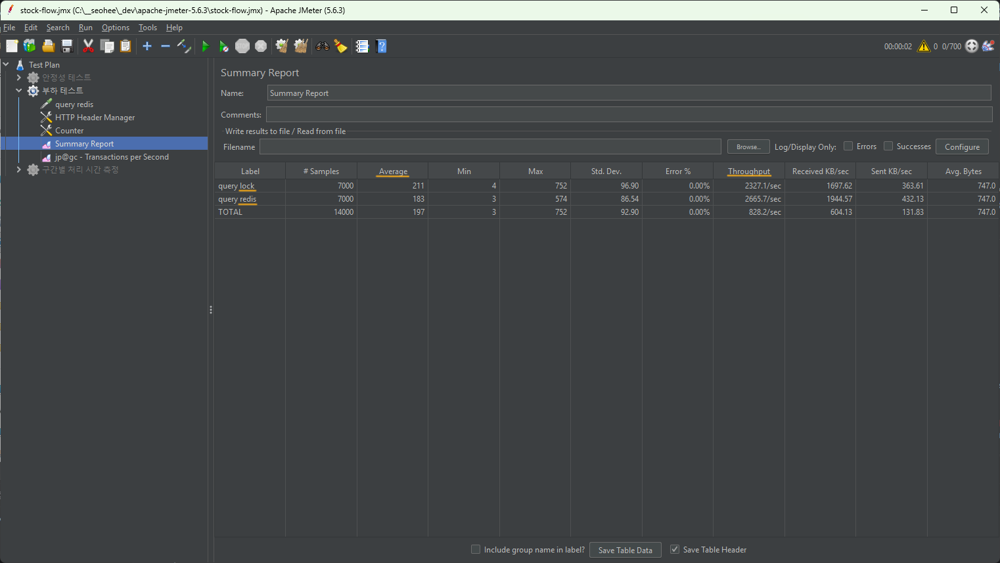
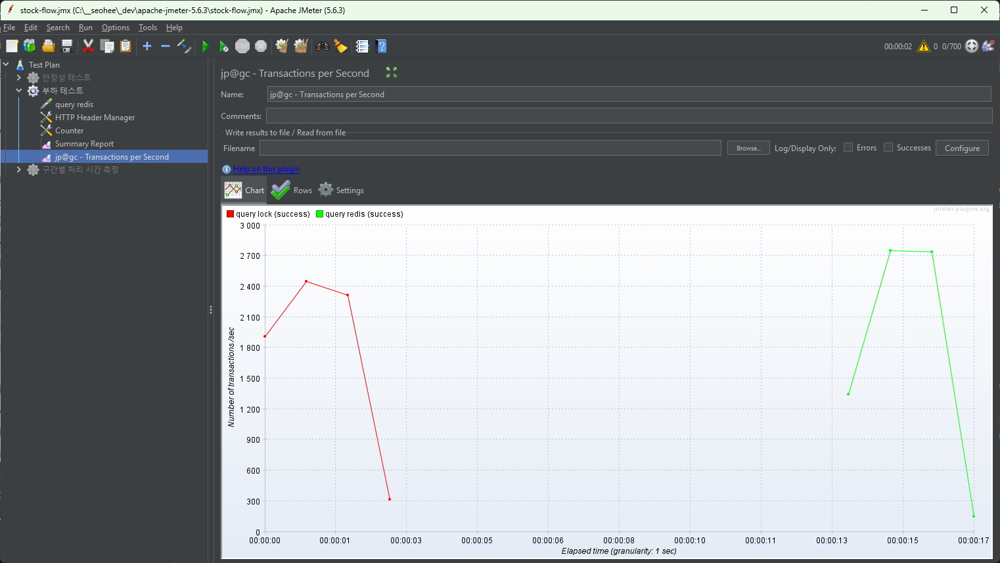
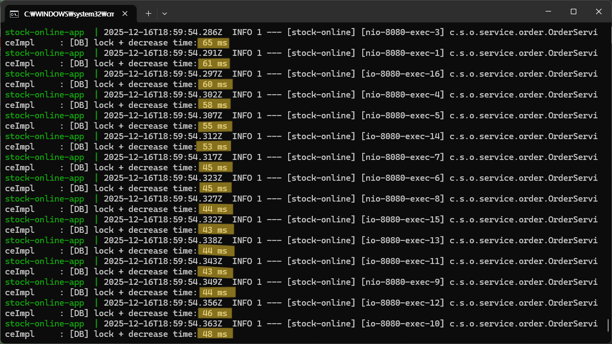
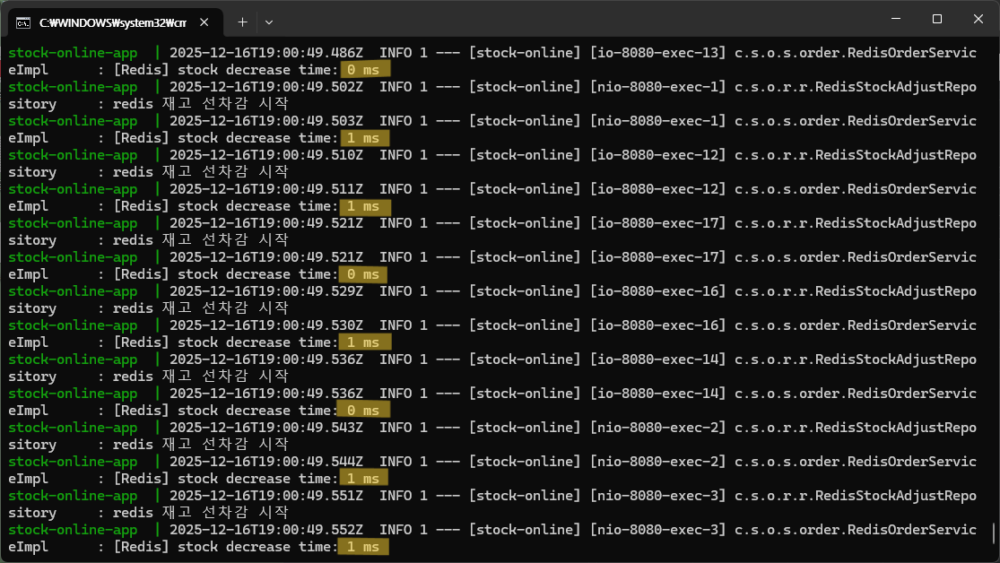
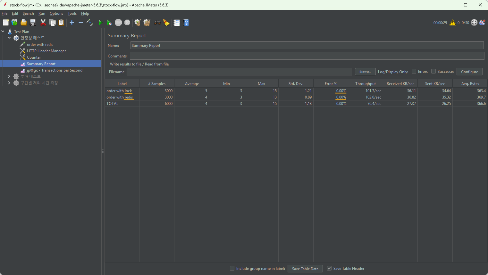
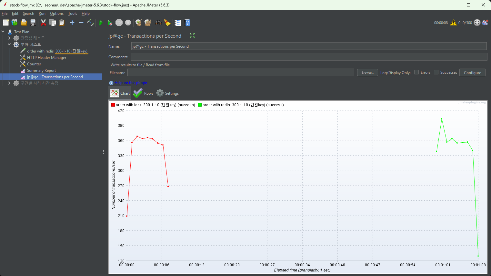
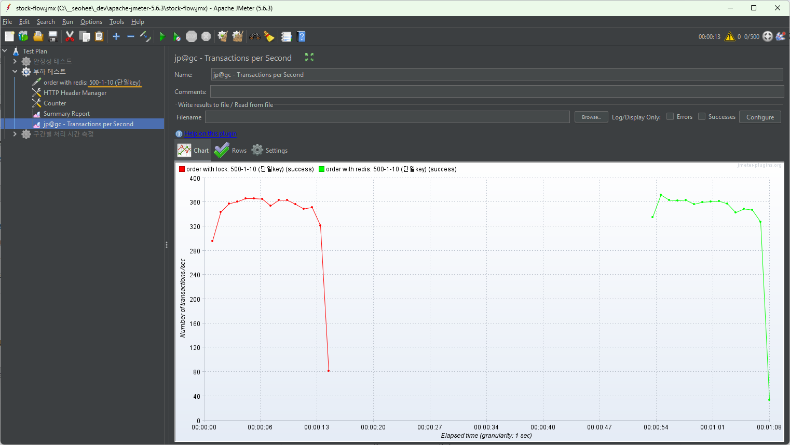
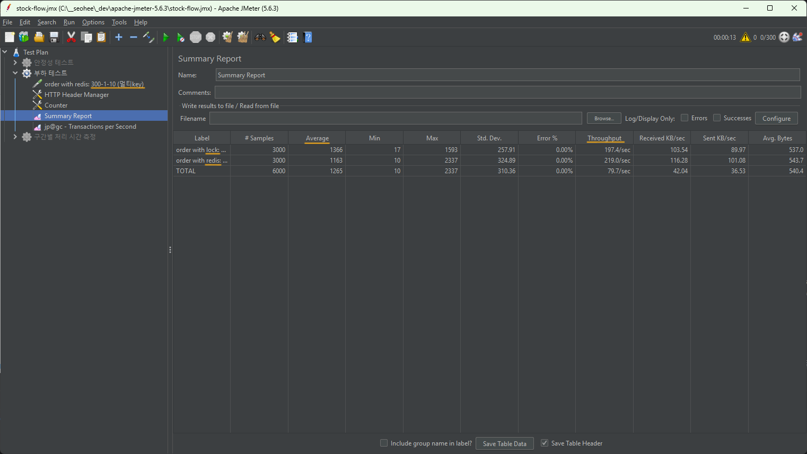
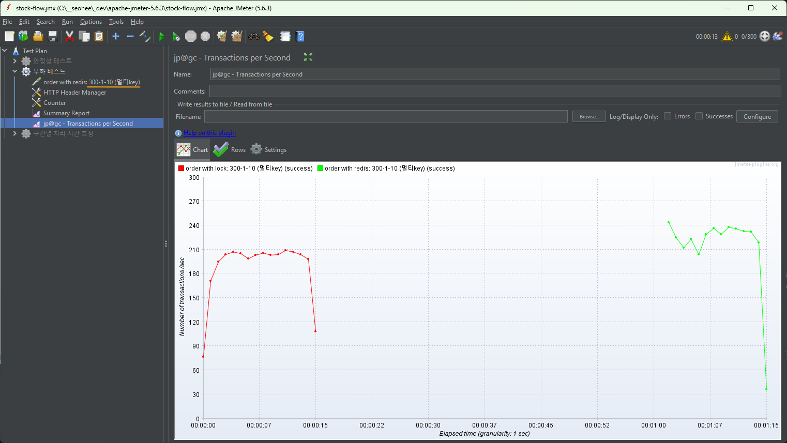
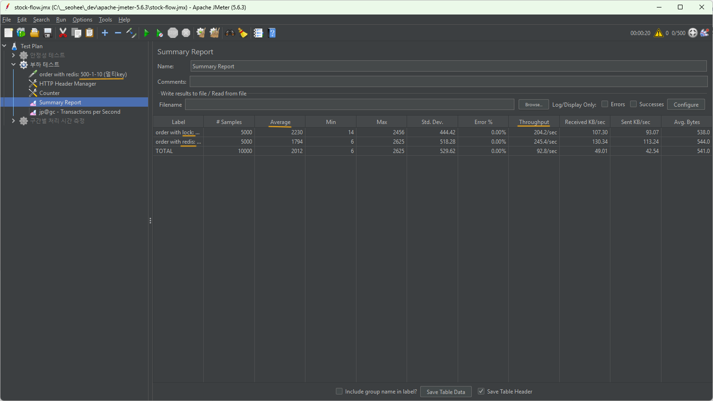

# 🗒️ Stock-Performance-Test (JMeter)

**상품(재고) 조회**
- #1. DB 동기 처리: DB에서 재고 확인 후 조회
- #2. Redis 선차감 처리: Redis에 저장된 재고 기준으로 조회 

**상품 주문/취소**
- #1. DB 동기 처리: DB에서 재고 차감/증가 후 응답 반환
- #2. Redis 선차감 처리: Redis에서 재고 선차감/선증가 후 응답 반환, 이후 Pub/Sub으로 DB 동기화

---

## ✏️ 조회(Read) 성능 비교
- Number of Threads (users): 700
- Ramp-up Period (seconds): 1
- Loop Count: 10

1. 상품 조회 (DB 동기 방식 / Redis 방식)

2. 상품 조회 (DB 동기 방식 / Redis 방식) -TPS

- 700 Threads 동시 요청 환경에서 Redis 기반 조회는 평균 응답 속도가 빠르고 처리량도 높게 나타났다.
---

## ✏️ 주문(Write) 성능 비교

### 01. 구간별 처리 시간 측정
DB 트랜잭션 및 락 처리를 포함한 경우와
Redis에서 lua 스크립트를 통해 원자적으로 선차감을 수행한 경우의 시간 차이를 비교해보았다.

3. DB 동기 처리 시 평균 응답 시간

4. Redis 선차감 처리 시 평균 응답 시간

- DB 동기 처리 시 평균 응답 시간: 약 50ms
- Redis 선차감 처리 시 평균 응답 시간: 약 1ms

---

### 02. 안정성 테스트
- 목적: 다중 요청 환경에서 정상 동작 여부 확인
- Number of Threads (users): 30
- Ramp-up Period (seconds): 30
- Loop Count: 100

30명의 사용자가 30초에 걸쳐 점진적으로 접속하며 각 사용자가 100번의 요청을 전송하도록 설정하였다.

5. 안정성 테스트 - summary

6. 안정성 테스트 - TPS

➡️ DB 기반 동기 처리 방식과 Redis 방식 모두 요청 증가 상황에서도 오류 없이 정상적으로 동작함을 확인하였다.

---

## 03. 부하 테스트
- 목적: 한 번에 많은 요청이 몰릴 때의 응답 속도와 처리량 확인 
  - 응답 속도: 요청 하나를 처리할 때 응답까지 걸리는 시간
  - 처리량: 1초동안 시스템이 처리한 요청 수 
- Number of Threads (users): 300/500/700
- Ramp-up Period (seconds): 1
- Loop Count: 10
- (단일상품/여러상품)

300/500/700명의 사용자가 동시에 접속하여 각각 10번의 요청을 전송하도록 설정하였다.
단일 상품을 주문하는 경우(단일key)와 여러개의 상품을 주문하는 경우(멀티key)로 나눠서 테스트를 진행하였다.

**<단일key 기준>**

7. 단일key / 300 Thread 테스트 결과

8. 단일key / 300 Thread 테스트 결과 - TPS

9. 단일key / 500 Thread 테스트 결과

10. 단일key / 500 Thread 테스트 결과 - TPS

11. 단일key / 700 Thread 테스트 결과

12. 단일key / 700 Thread 테스트 결과 - TPS

**<멀티key 기준>**

13. 멀티key / 300 Thread 테스트 결과

14. 멀티key / 300 Thread 테스트 결과 - TPS

15. 멀티key / 500 Thread 테스트 결과

16. 멀티key / 500 Thread 테스트 결과 - TPS

17. 멀티key / 700 Thread 테스트 결과

18. 멀티key / 700 Thread 테스트 결과 - TPS

➡️ Redis 방식이 DB 동기 처리 방식보다 응답 속도가 빨랐고 처리량(TPS)도 높게 측정되었다.
Redis가 메모리 기반이고 Lua 스크립트 원자 처리를 통해 빠르게 요청을 처리할 수 있고
DB 동기 방식은 트랜잭션 오버헤드, 멀티 key 인덱스 탐색, 스레드 컨텍스트 스위칭 등으로 인해 평균적인 처리 속도가 제한되었다.

19. 단일Key / 300 Thread 테스트 결과 - DB 동기 방식이 높게 나온 case

20. 단일Key / 300 Thread 테스트 결과 - DB 동기 방식이 높게 나온 case - TPS

➡️ 테스트 환경 초기화 후 반복적으로 테스트를 진행한 결과 
일부 요청에서는 DB 동기 방식이 Redis보다 응답이 빠르고 처리량이 높게 나타나기도 했으나(19,20번 사진),
전반적으로 Redis 방식이 평균 응답 시간은 빠르고 처리량(TPS)도 높게 측정되었다.
